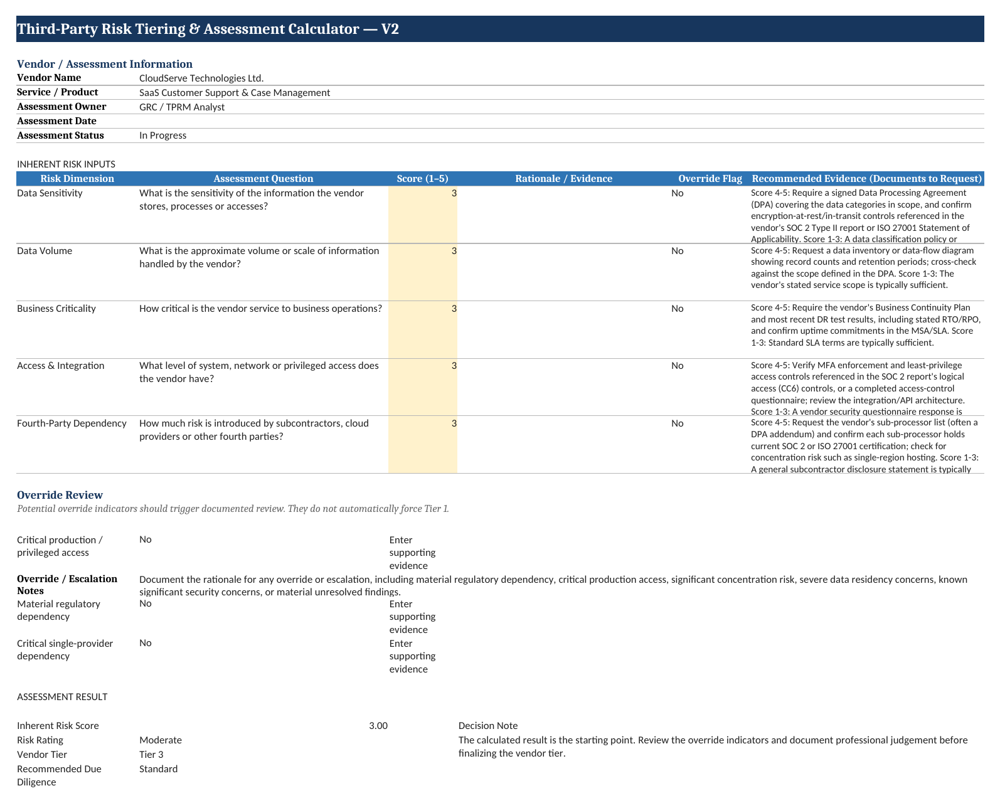
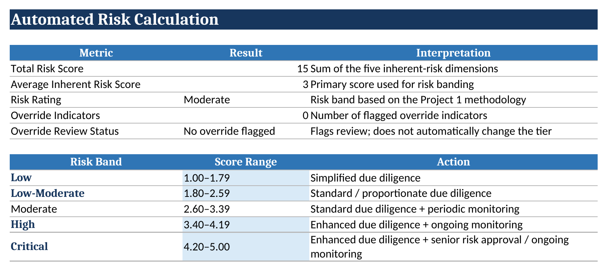
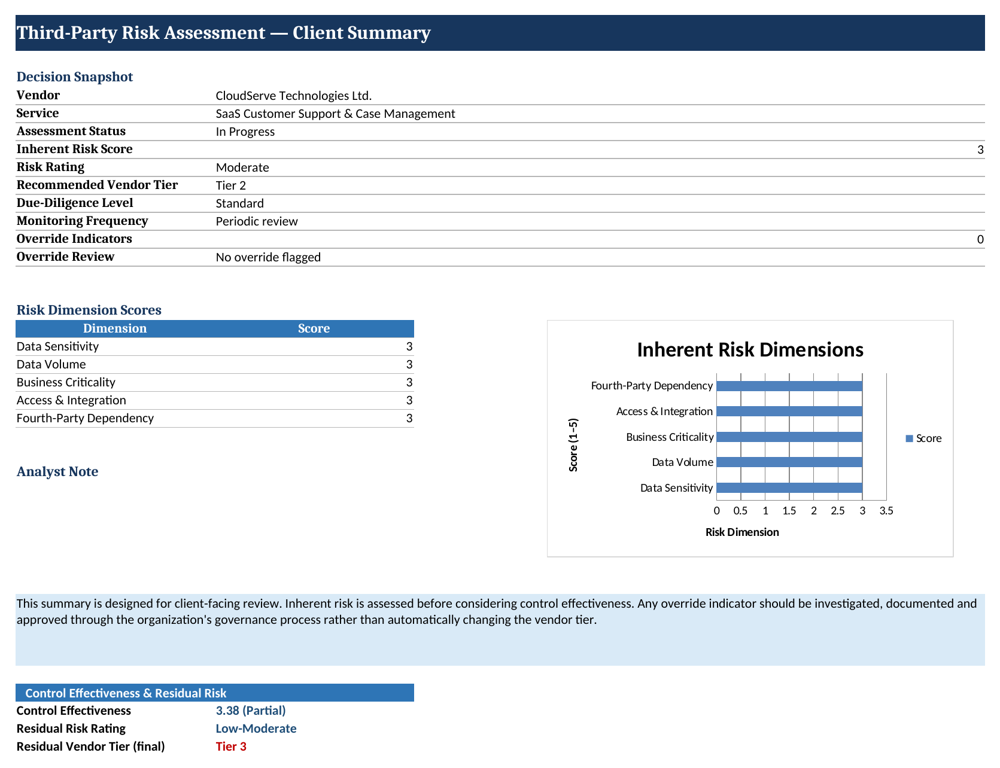
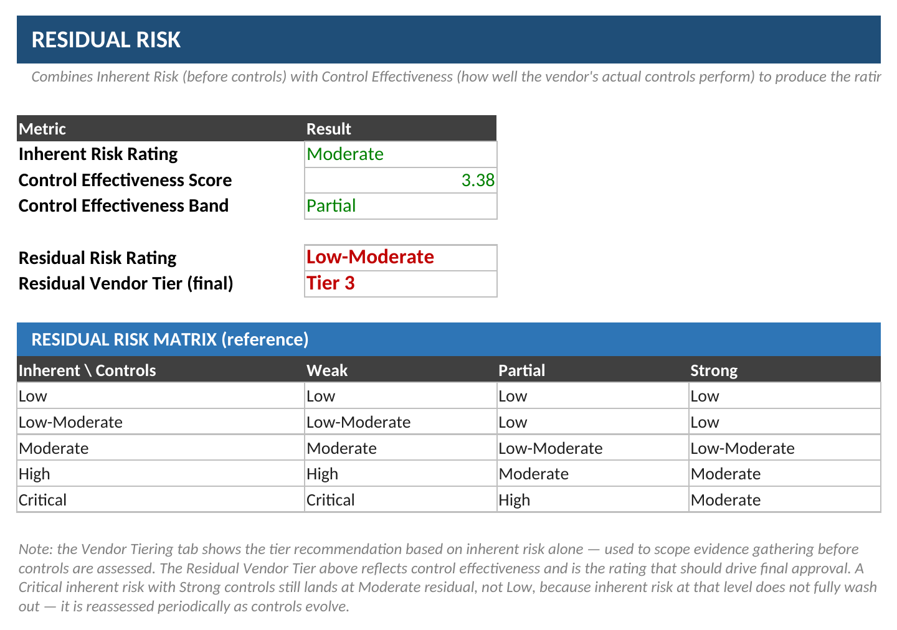

# Third-Party Risk Tiering & Assessment Calculator

> ⚠️ **Portfolio / self-initiated project:** This is a fictional TPRM assessment built for demonstration purposes. The vendor used throughout — **CloudServe Technologies Ltd.** — is fictional, and no real client, vendor, or confidential data is involved.

A practical **Third-Party Risk Management (TPRM)** calculator designed to demonstrate how organizations can move from **inherent risk identification** to **control evaluation**, **residual risk assessment**, and ultimately **risk-based vendor tiering and oversight**.

The objective is not simply to produce a risk score.

The objective is to make the reasoning behind the score **visible, explainable, evidence-driven, and actionable**.

**Try it live (no download, no macros to enable):** [Open the Google Sheet →](https://docs.google.com/spreadsheets/d/1bl1hgFhLjI8Sm18auMe6HGjDha1uOkOxb6hilwgT6iQ/edit?usp=sharing)

**Download the Excel version:** [`TPRM_risk-calculator.xlsx`](./risk-calculator/TPRM_risk-calculator.xlsx)

---

## Screenshots

**Assessment tab** — inputs, evidence guidance tied to real documents, and the override review section:



**Risk Calculation** — the formulas behind the score:



**Client Summary** — the one-page rollup a client actually reads:



**Residual Risk matrix** — inherent risk and control effectiveness combined into a final, defensible rating:



---

## What This Project Demonstrates

Many vendor risk assessments stop at a questionnaire and a risk score.

That creates a problem.

A score such as `4.2 / 5.0` does not, by itself, explain:

- Why the vendor is considered high or critical risk
- What is driving the exposure
- Which controls reduce that exposure
- What risk remains after controls are considered
- What level of due diligence is appropriate
- What level of ongoing monitoring is required
- Whether management needs to accept, mitigate, transfer, or avoid the risk

This calculator addresses that gap by connecting the major stages of a TPRM risk assessment:

**Inherent Risk → Control Effectiveness → Residual Risk → Vendor Tier → Due Diligence & Oversight**

The workbook is designed so that the assessment remains **transparent and reviewable**, rather than functioning as a black-box scoring tool.

---

## Core TPRM Principle

> **The goal of TPRM is not to eliminate every vendor risk. It is to understand the exposure, determine what controls reduce it, understand what remains, and make an informed risk decision.**

A vendor can have strong security controls and still represent significant inherent risk.

For example:

- A vendor may process highly sensitive information.
- A critical business service may depend heavily on the vendor.
- The vendor may have privileged access to internal systems.
- The organization may have limited alternatives if the vendor becomes unavailable.
- The vendor may depend on important fourth parties or cloud providers.

These factors exist before considering the effectiveness of the vendor's controls.

That is why **inherent risk must be assessed before control effectiveness**.

---

# Methodology

The calculator follows four primary assessment stages.

## 1. Inherent Risk Assessment

Inherent risk represents the level of risk associated with the vendor **before considering the effectiveness of controls or mitigation measures**.

The calculator evaluates five risk dimensions.

### Data Sensitivity

Assesses the sensitivity of the information the vendor stores, processes, or accesses.

Examples include:

- Public information
- Internal business information
- Confidential information
- Sensitive information
- Highly sensitive or regulated information

### Data Volume

Considers the approximate scale or volume of information handled by the vendor.

A vendor processing a small amount of internal information may present a different exposure from a vendor processing millions of customer records.

### Business Criticality

Evaluates how important the vendor's service is to business operations.

Questions include:

- Is the service business-critical?
- How difficult would the vendor be to replace?
- What would happen if the service became unavailable?
- Does the vendor support an important operational process?

### Access & Integration

Evaluates the level of access the vendor has to organizational systems, applications, networks, or sensitive environments.

Examples include:

- No system access
- Limited access
- Standard integration
- Sensitive system integration
- Privileged or critical access

### Fourth-Party Dependency

Considers risks introduced through subcontractors, sub-processors, cloud providers, and other dependencies within the vendor's supply chain.

This is important because the organization may be exposed to risks that exist beyond the direct vendor relationship.

---

# Risk Scoring

Each inherent-risk dimension is scored on a **1–5 scale**.

| Score | General Meaning |
|---|---|
| 1 | Very Low |
| 2 | Low |
| 3 | Moderate |
| 4 | High |
| 5 | Very High / Critical |

The individual dimensions are combined to produce an overall inherent-risk score.

The score is then mapped to a risk-rating band.

> **Important:** The calculated score is a starting point for professional judgement, not an automatic final decision.

---

# Override & Escalation Review

A numerical average should never be allowed to hide a material risk factor.

The calculator therefore includes an independent override/escalation review.

Potential escalation indicators include:

- Critical production or privileged access
- Highly sensitive or regulated data
- Material regulatory dependency
- Critical single-provider dependency
- Significant concentration risk
- Material unresolved security concerns

An override indicator does **not automatically force a vendor into the highest tier**.

Instead, it triggers a documented review.

This creates an important governance control:

> **The calculator supports judgement; it does not replace judgement.**

---

# 2. Control Effectiveness Assessment

Once inherent risk has been established, the next question is:

> **How effective are the controls designed to reduce that risk?**

Control effectiveness is assessed separately from inherent risk.

The calculator uses eight control domains:

1. **Identity & Access Management**
2. **Encryption**
3. **Vulnerability Management**
4. **Incident Response**
5. **Business Continuity & Disaster Recovery**
6. **Fourth-Party Risk Management**
7. **Privacy & Data Processing**
8. **Data Return & Destruction**

Each control domain is assessed using a **1–5 effectiveness scale** and includes an evidence-reviewed indicator.

The intention is to move beyond:

> "The vendor says the control exists."

toward:

> "What evidence demonstrates that the control exists and is operating effectively?"

---

# Evidence-Based Assessment

Examples of supporting evidence may include:

- SOC 2 Type II reports
- ISO 27001 certification and Statement of Applicability
- Data Processing Agreements
- Business Continuity Plans
- Disaster Recovery test results
- Penetration testing reports
- Vulnerability management reports
- Incident response documentation
- Access-control documentation
- Security policies
- Data retention and destruction procedures

Evidence should be reviewed in proportion to the vendor's risk profile.

A low-risk vendor should not necessarily receive the same depth of due diligence as a critical technology provider.

---

# 3. Residual Risk Assessment

Residual risk represents the risk that remains **after considering controls and mitigation measures**.

The relationship can be represented as:

**Inherent Risk → Controls & Mitigation → Residual Risk**

The key question changes from:

> "How risky is this vendor?"

to:

> **"What risk are we still living with after considering the controls?"**

This distinction is critical in TPRM.

A vendor can have:

- High inherent risk
- Strong controls
- Moderate residual risk

That does not mean the assessment failed.

It means the organization has identified the risk, evaluated the controls, and determined what remains.

---

# Why the Calculator Uses a Matrix for Residual Risk

The calculator deliberately avoids a simplistic formula such as:

`Residual Risk = Inherent Risk × (1 − Control Effectiveness %)`

Although such a formula may appear mathematically sophisticated, it can be difficult to defend from a governance perspective.

Why should risk be reduced by a particular percentage?

Why should multiplication be used?

What evidence supports the weighting?

Instead, this calculator uses a **lookup matrix**:

**Inherent Risk Rating × Control Effectiveness Band → Residual Risk Rating**

This makes the outcome easier to explain and review.

For example:

> **Critical Inherent Risk + Strong Controls → Moderate Residual Risk**

The reasoning is straightforward:

Strong controls can materially reduce exposure, but they do not necessarily make a fundamentally critical dependency disappear.

Residual risk therefore remains subject to:

- Ongoing monitoring
- Periodic reassessment
- Control changes
- Business changes
- Threat changes
- Vendor changes
- Changes in organizational dependency

---

# 4. Vendor Tiering

Risk tiering translates assessment results into an appropriate level of oversight.

A higher-risk vendor generally requires greater assurance and more frequent monitoring.

The calculator maps assessment outcomes to vendor tiers.

| Vendor Tier | Risk Rating | Due-Diligence Level | Monitoring Frequency |
|---|---|---|---|
| Tier 1 | Critical | Enhanced | Continuous / at least annual formal review |
| Tier 2 | High | Detailed | Periodic review (semi-annual) |
| Tier 3 | Moderate | Standard | Periodic review (annual) |
| Tier 4 | Low / Low-Moderate | Simplified | Simplified / ad hoc review |

The exact thresholds should be adapted to the organization's:

- Risk appetite
- TPRM policy
- Regulatory requirements
- Business model
- Industry
- Vendor population
- Criticality criteria

---

# Risk-Based Due Diligence

The purpose of vendor tiering is not to label vendors.

It is to determine the **appropriate depth of assurance**.

For example:

A vendor providing office supplies should generally not require the same assessment depth as a cloud service provider processing sensitive customer information and integrated with critical business systems.

A risk-based approach allows organizations to focus resources where they provide the greatest value.

---

# Workbook Structure

The calculator contains several interconnected worksheets.

| Worksheet | Purpose |
|---|---|
| **Assessment** | Primary vendor assessment input screen |
| **Scoring Matrix** | Defines the 1–5 scoring criteria and rating bands |
| **Risk Calculation** | Calculates scores, ratings, override status, and base tier |
| **Vendor Tiering** | Maps vendor tiers to due diligence and monitoring expectations |
| **Control Evaluation** | Assesses the effectiveness of key control domains |
| **Residual Risk** | Combines inherent risk and control effectiveness |
| **Client Summary** | Provides a concise management-level view of the assessment |
| **User Guide** | Explains how to use the calculator |

---

# Assessment Workflow

The intended workflow is:

```text
Vendor Information
        ↓
Inherent Risk Assessment
        ↓
Override / Escalation Review
        ↓
Vendor Risk Rating
        ↓
Vendor Tier
        ↓
Risk-Based Due Diligence
        ↓
Control Effectiveness Assessment
        ↓
Residual Risk Assessment
        ↓
Risk Treatment / Decision
        ↓
Ongoing Monitoring & Reassessment
```